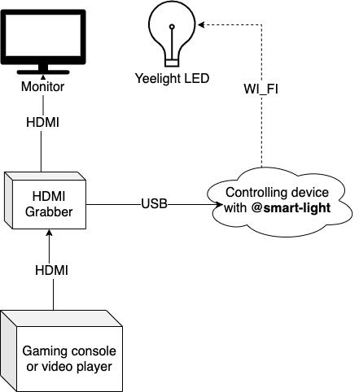

# Smart light utils

This project contains some utilities to make interesting things with **yeelight** smart light bulbs

## Idea

Main idea of this project is in setting bulb light color in sync with image in game or film

## Project contains

### @smart-light/colors

Utilities to operate with colors

### [@smart-light/light-bulb](packages/light-bulb)

Utilities to connect and send commands to **yeelight** light bulb

### [@smart-light/usb-screenshoter](packages/usb-screenshoter)

Utilities to initialize connection with usb recording device and take images from it

### @smart-light/example

Simple example on how to use packages
